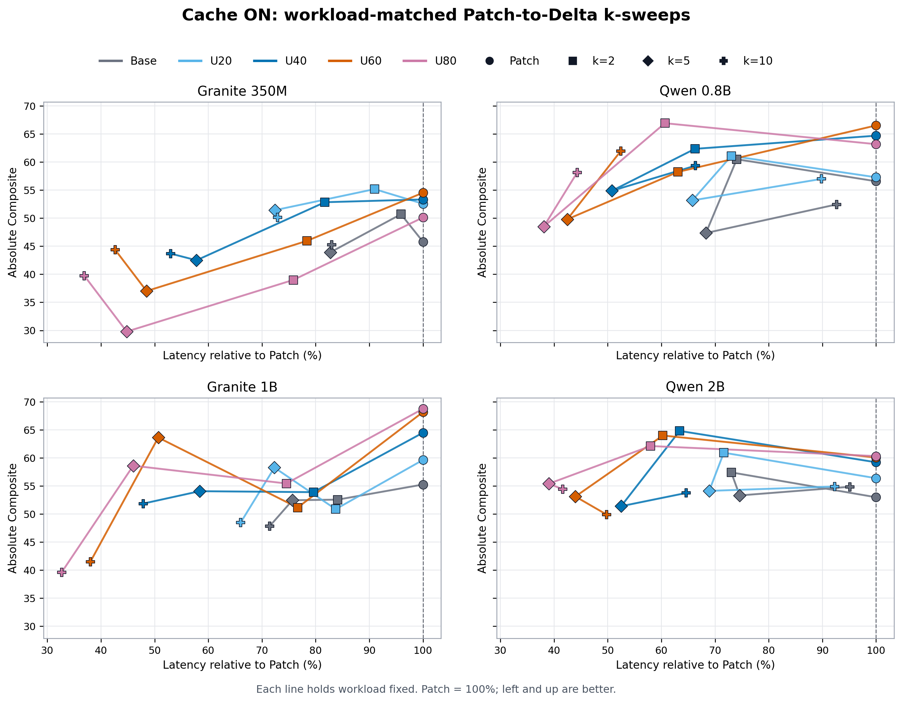
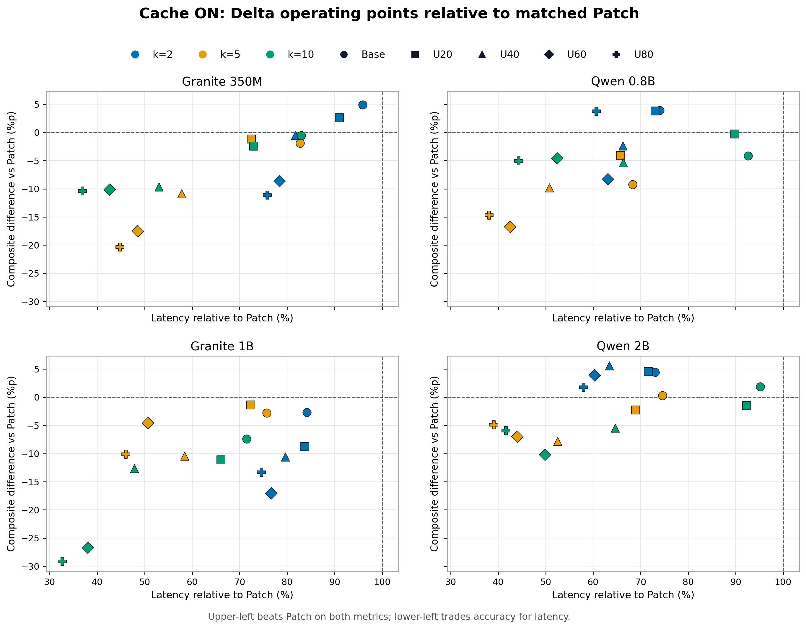

# Cache-ON Patch–Delta Figure 대안 비교

## 공통 범위

- Held-out stress subset S86–S90, 5 scenarios
- Granite 350M, Qwen 0.8B, Granite 1B, Qwen 2B
- Patch, Delta-v3 compact k2/k5/k10
- Base, U20, U40, U60, U80
- X축: 동일 모델·workload의 Patch update-cycle latency를 100%로 둔 상대 latency
- Update-cycle: UPDATE turn decode + 직후 turn prefill
- Cache ON만 본문 대상으로 사용한다. Cache OFF는 sanity check/appendix로 이동한다.

## 대안 A: Absolute Composite k-sweep



- 한 선은 동일 workload를 고정하고 `Patch → k2 → k5 → k10`을 연결한다.
- Y축은 absolute Composite라 모델의 실제 성능 수준을 유지한다.
- k 증가에 따른 latency–accuracy 이동을 직접 읽을 수 있다.
- 여러 workload 선이 교차하는 모델에서는 여전히 복잡해질 수 있다.

**용도:** 논문 main figure 후보. 사용자가 요구한 absolute Composite–relative latency를
그대로 만족한다.

## 대안 B: Patch-relative quadrant



- Patch 기준은 `(latency=100%, Composite Δ=0)`이다.
- 왼쪽 위: latency와 Composite 모두 Patch보다 우수
- 왼쪽 아래: latency를 줄이는 대신 Composite가 하락하는 trade-off
- 선을 제거해 개별 operating point와 모델 차이를 빠르게 읽을 수 있다.
- absolute Composite 수준이 사라지므로 단독 성능 보고용으로는 부족하다.

**용도:** 분석/설명용 figure 또는 main figure의 보조 패널.

## 대안 C: Full-Test Composite + Stress Latency


- Y축은 자연 Test 전체 24개 시나리오의 모델·방법별 Composite다.
- X축은 S86–S90 5개 stress subset의 Base/U20/U40/U60/U80 Cache-ON latency다.
- 같은 방법의 Y값을 workload마다 반복하므로, 선의 수평 이동이 latency scaling만 나타낸다.
- 5개 시나리오 Stress Composite의 변동성이 제거되어 전체적인 모델 품질을 더 안정적으로
  표현한다.
- 정확도와 latency가 동일 workload에서 측정된 것은 아니므로 stress-condition Pareto라고
  부르면 안 된다.

**용도:** 모델의 전체 Test 품질을 유지하면서 stress latency 민감도를 보여주는
deployment-oriented figure 후보.

## 추천

1. 전체 Test 품질을 중심으로 쓰면 대안 C, 동일 stress 조건의 엄밀한 Pareto가 목적이면
   대안 A를 사용한다.
2. Supporting: 대안 B로 Patch 대비 win/trade-off 영역을 설명한다.
3. Cache OFF는 본문에서 제외하고, Patch와 Delta latency가 거의 같다는 sanity check 표만
   appendix에 둔다.
4. 현재처럼 전체 Test Composite의 신뢰도를 우선하면 대안 C를 main으로 선택하고,
   동일 stress 조건의 정확도 결과는 appendix에서 대안 A로 보존한다.

## 재현

- 코드: `memory_training/scripts/plot_cache_on_tradeoff_alternatives.py`
- 입력: `docs/engineering/results/stress-tradeoff-four-models.json`
- 출력:
  - `docs/engineering/figures/cache-on-patch-delta-absolute-composite-k-sweeps.{png,pdf}`
  - `docs/engineering/figures/cache-on-patch-relative-delta-quadrants.{png,pdf}`
  - `docs/engineering/figures/full-test-composite-cache-on-stress-latency.{png,pdf}`

```bash
/mnt/nvme2/hj153lee/conda-envs/palmclaw-memory-sft/bin/python \
  memory_training/scripts/plot_cache_on_tradeoff_alternatives.py
```

대안 C는 별도 코드로 재현한다.

```bash
/mnt/nvme2/hj153lee/conda-envs/palmclaw-memory-sft/bin/python \
  memory_training/scripts/plot_full_test_composite_stress_latency.py
```
