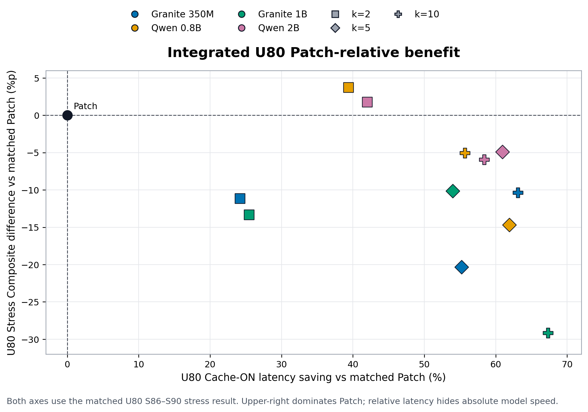
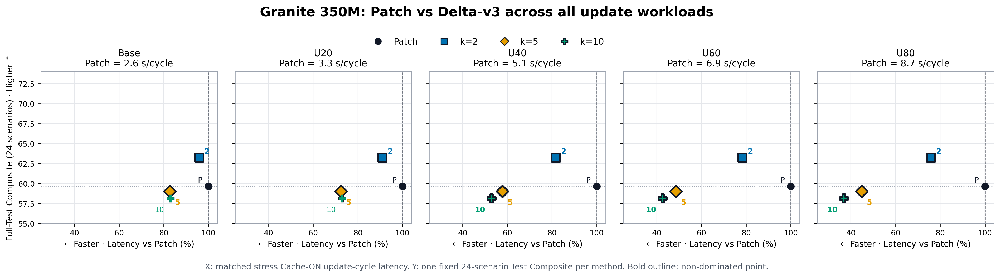
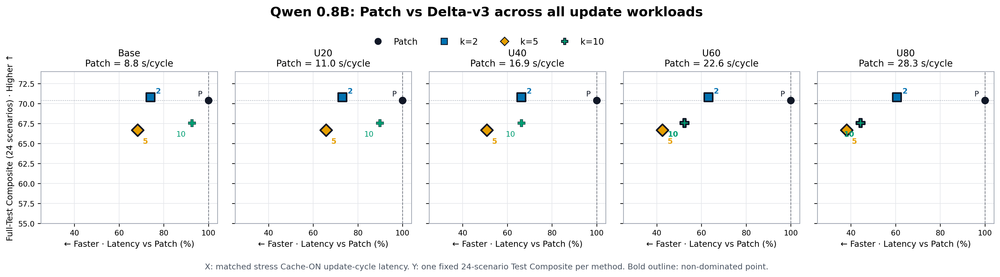
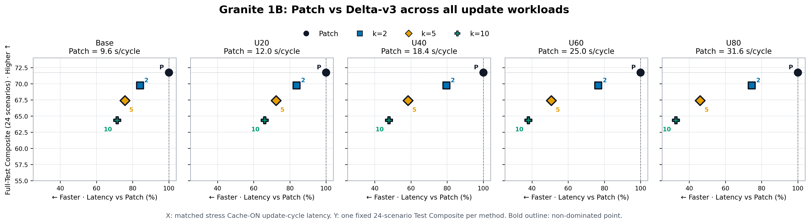
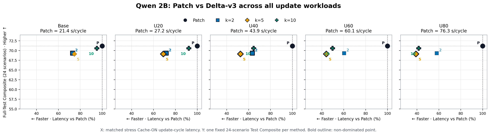

# Appendix: 전체 Stress Accuracy–Latency Operating Points

## 정의

- 모델 4개 × workload 5개 = 총 20개 패널
- 각 패널: Patch, Delta-v3 `k=2/5/10`의 4개 operating point
- X축: 동일 모델·동일 workload Patch 대비 Cache-ON update-cycle latency
- Y축: 전체 자연 Test 24개 시나리오의 방법별 Composite. 동일 방법의 값은 다섯
  workload 패널에서 고정된다.
- 패널 제목의 `Patch = ... s/cycle`은 정규화 전 Patch 절대 projected latency다.
- 네 모델 모두 Y축을 `55–74`로 통일했다.
- 점 옆의 `P/2/5/10`은 각각 Patch와 Delta-v3 k를 뜻한다.
- 굵은 점 테두리는 해당 패널의 경험적 비지배점을 나타낸다.
- X축 왼쪽은 더 빠르고, Y축 위쪽은 더 정확하다.

각 operating point는 24-scenario main-Test quality와 별도 S86–S90 stress runtime을
결합한 배포 관점 비교다. 동일 stress workload에서 accuracy와 latency를 함께 측정한
엄밀한 Pareto로 해석하지 않는다.

## Main 후보: 통합 U80 benefit



- X축: 동일 모델 U80 Patch 대비 Cache-ON latency 절감률
- Y축: 동일 모델 Patch 대비 Full-Test Composite 차이
- 색은 모델, 모양은 `k=2/5/10`을 뜻한다.
- Patch는 공통 원점 `(0, 0)`이며 오른쪽 위가 Patch를 지배하는 영역이다.
- 모델별 상대값을 통합하므로 모델의 절대 latency 차이는 나타내지 않는다.

## Granite 350M



## Qwen 0.8B



## Granite 1B



## Qwen 2B



## 재현

```bash
/mnt/data/hj153lee/conda-envs/palmclaw-memory-sft/bin/python \
  memory_training/scripts/plot_delta_v3_appendix_operating_points.py
```

- 입력: `docs/engineering/results/stress-tradeoff-four-models.json`
- 코드: `memory_training/scripts/plot_delta_v3_appendix_operating_points.py`
- 통합 U80 코드: `memory_training/scripts/plot_delta_v3_u80_integrated_benefit.py`
- 출력: `docs/engineering/figures/delta-v3-appendix-operating-points-*.{png,pdf}`
