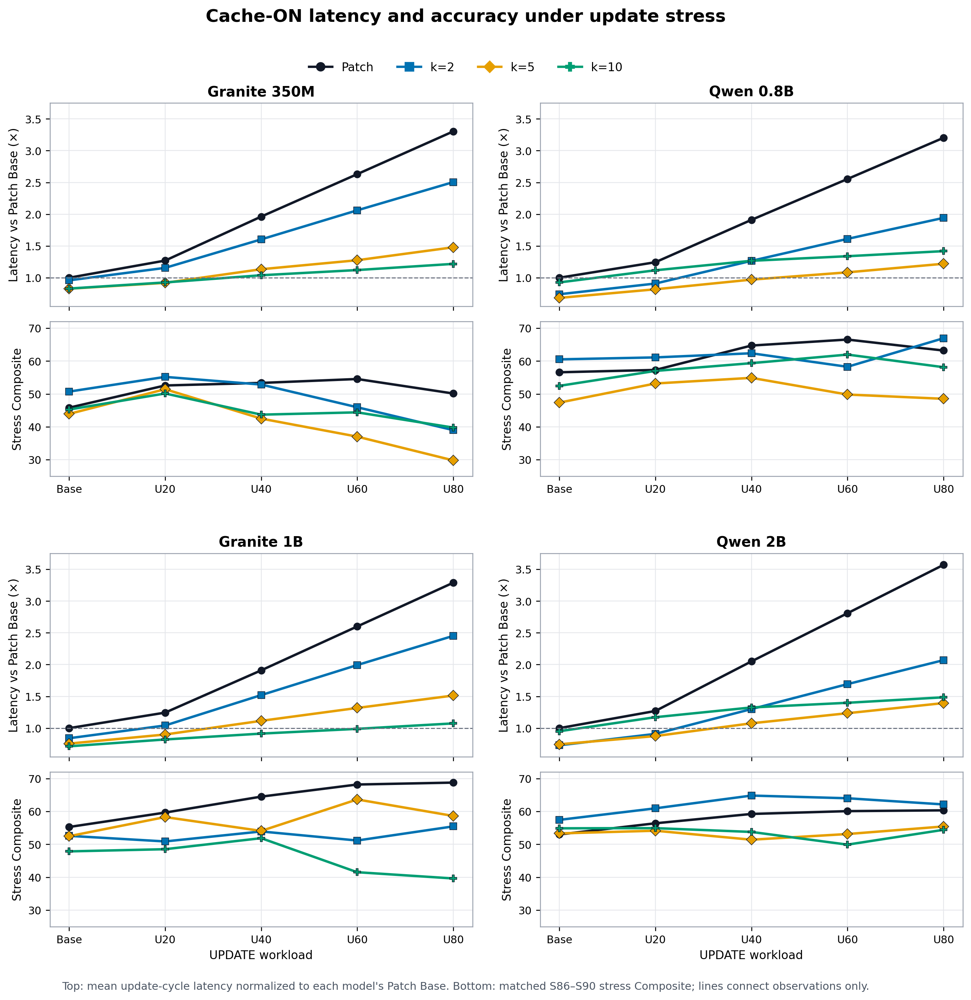
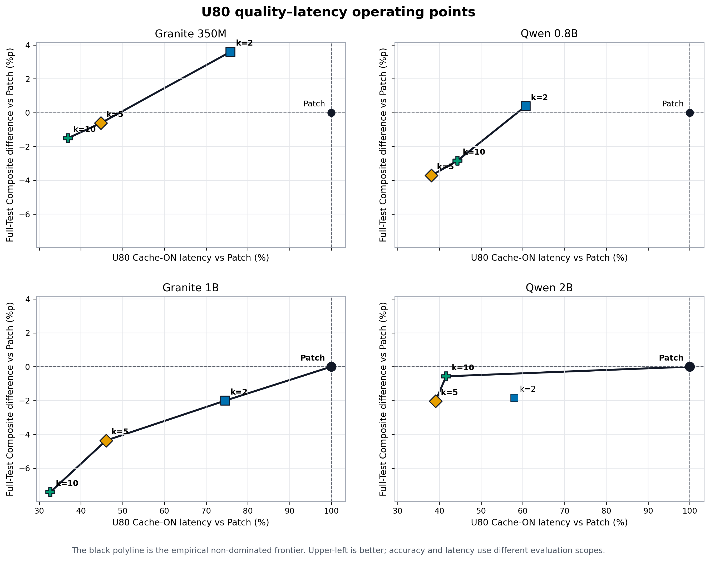
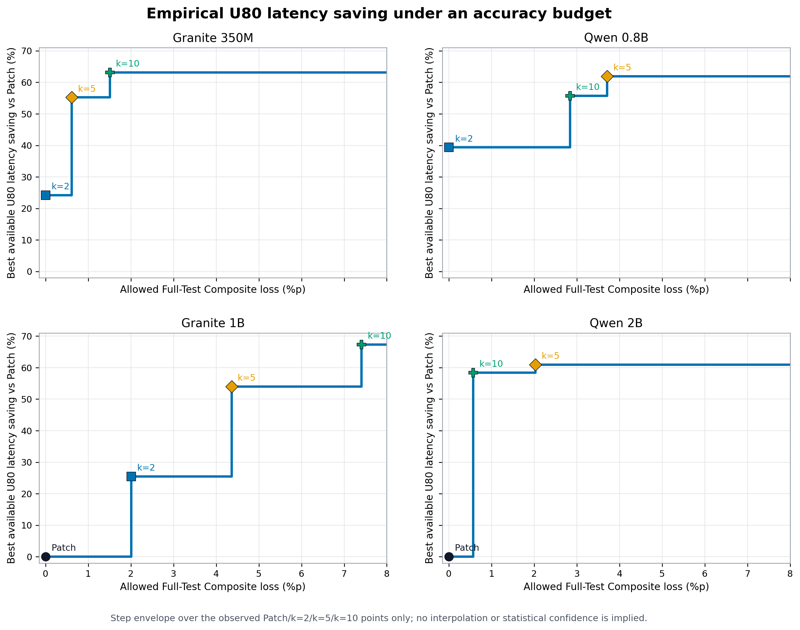
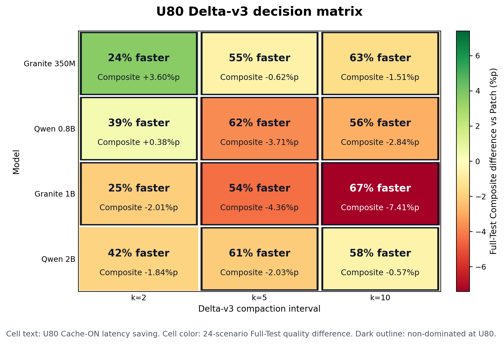

# Delta-v3 Patch-relative Figure 재설계

## 공통 데이터

- Quality: Figure 1은 S86–S90 Stress Composite, Figure 2–4는 전체 자연 Test 24개
  시나리오의 Composite
- Runtime: Stress S86–S90의 Cache-ON update-cycle 평균 latency
- Update-cycle: UPDATE turn decode + 바로 다음 post-UPDATE turn prefill
- Runtime 기준: Figure 1은 동일 모델의 Patch Base = 1.0, Figure 2–4는 동일 모델·동일
  workload의 Patch = 100%
- 대상: Patch와 Delta-v3 compact `k=2/5/10`

Figure 1은 동일 Stress 데이터의 quality와 runtime을 정렬한다. Figure 2–4는 평가 범위가
다르므로 엄밀한 동일 데이터셋 Pareto가 아니라, **main-Test quality와 stress runtime
민감도를 결합한 배포 관점 비교**다.

## Figure 1: Stress latency–quality scaling



- X축은 `Base → U20 → U40 → U60 → U80` workload다.
- 상단 Y축은 각 모델의 `Patch Base` update-cycle latency를 1.0으로 고정한 Cache-ON
  latency다. 따라서 Patch 자체의 비용 증가도 보존된다.
- 하단 Y축은 동일 S86–S90 stress workload에서 실제로 측정한 Composite다.
- Stress Composite는 5개 시나리오 결과이고 비단조적이므로, 연결선은 관측점을 읽기 위한
  보조선이지 선형 accuracy scaling을 의미하지 않는다.

## Figure 2: U80 operating points



- 가장 강한 U80 조건만 남겨 복잡도를 줄였다.
- 검은 선은 관측된 Patch/k 후보 중 비지배점만 연결한다.
- Granite 350M과 Qwen 0.8B의 k2는 Patch보다 빠르고 Full-Test Composite도 높다.
- Granite 1B와 Qwen 2B에서는 quality–latency 절충이 나타난다.

## Figure 3: Accuracy-budget envelope



- 주어진 Full-Test Composite 손실 예산 안에서 선택 가능한 최대 U80 latency 절감률이다.
- 관측한 네 후보만 사용한 계단 함수이며 후보 사이를 보간하지 않는다.
- 정책적 선택을 설명하기 좋지만, 반복 seed의 통계적 신뢰구간으로 해석하면 안 된다.

## Figure 4: Decision matrix



- 셀의 큰 숫자: U80 Cache-ON latency 절감률
- 셀의 작은 숫자와 색: Full-Test Composite 차이
- 검은 테두리: 해당 모델의 U80 비지배 Delta 후보
- 정확한 값을 가장 빠르게 읽을 수 있어 Figure 1 또는 2의 요약 표 역할에 적합하다.

## 권장 배치

1. Main mechanism: Figure 1
2. Main operating-point comparison: Figure 2
3. Compact numerical summary: Figure 4
4. Deployment-policy analysis 또는 appendix: Figure 3

## 주의

- Qwen 0.8B·2B Patch의 Full-Test quality는 seed46이고 나머지 선택 결과는 seed45다.
- 현재 Qwen Patch stress cache trace는 기존 측정 결과이므로 seed46 quality와 동일
  checkpoint에서 다시 측정한 latency는 아니다.
- Figure 2를 엄밀한 `U80 Pareto`라고 부르려면 Y도 5개 U80 stress 시나리오 Composite로
  바꿔야 한다. 현재 그림은 더 안정적인 24개 Test quality를 사용한다.

## 재현

```bash
/mnt/data/hj153lee/conda-envs/palmclaw-memory-sft/bin/python \
  memory_training/scripts/plot_delta_v3_four_figure_redesign.py
```

- 입력: `docs/engineering/results/stress-tradeoff-four-models.json`
- 코드: `memory_training/scripts/plot_delta_v3_four_figure_redesign.py`
- 출력: `docs/engineering/figures/delta-v3-{stress-response-arrows,u80-pareto-by-model,u80-accuracy-budget-envelope,u80-decision-matrix}.{png,pdf}`
