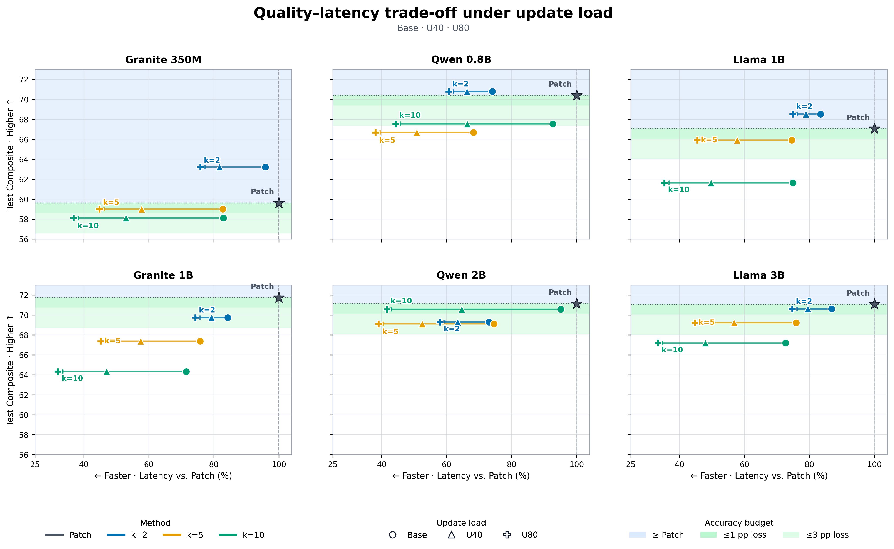
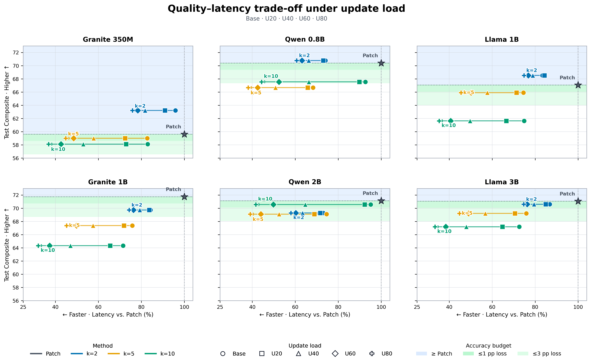

# Delta-v3 6-model workload-response Figure

## 목적

자연 Test의 일반 정확도를 얼마나 보존하면서 UPDATE-heavy 환경의 runtime 비용을
줄이는지 모델별로 보여준다. Stress 환경의 5-scenario Composite는 사용하지 않는다.

- Y축: 선택 checkpoint의 24-scenario Test Composite
- X축: 동일 모델·동일 workload의 Patch 대비 cache-ON update-cycle latency
- 좋은 방향: 왼쪽(빠름), 위쪽(정확함)
- 방법: Patch, Delta-v3 compact `k=2/5/10`
- 모델: Granite 350M, Qwen 0.8B, Llama 1B, Granite 1B, Qwen 2B, Llama 3B

## Metric 정의

한 update cycle은 다음 두 비용의 합이다.

```text
UPDATE turn decode tokens / decode tok/s
+ immediate post-UPDATE evaluated prefill tokens / prefill tok/s
```

표시된 값은 gold UPDATE 뒤에 같은 scenario/repetition의 다음 turn이 존재하는 cycle의
평균이다. Cache-ON이므로 post-UPDATE prompt 전체가 아니라 실제 재계산한
`evaluated_prefill_tokens`를 사용한다.

X축은 workload마다 다음처럼 정규화한다.

```text
relative latency (%) = 100 × method latency / matched Patch latency
```

따라서 Patch의 Base/U20/U40/U60/U80은 모두 100%에서 겹치며 하나의 별표로 표시한다.
Delta의 수평 화살표는 Base에서 U80로 workload가 증가할 때 Patch 대비 상대 비용이
어떻게 이동하는지를 뜻한다. 서로 다른 workload를 잇기 때문에 Pareto frontier가
아니라 workload-response trajectory다.

## 시각 인코딩

- 색: 방법론
- 마커: Base/U20/U40/U60/U80
- 파란 영역: Patch와 같거나 높은 Composite
- 진한 녹색: Patch 대비 1%p 이내 손실
- 연한 녹색: Patch 대비 3%p 이내 손실
- 직접 라벨: 방법론

선택 epoch와 모델별 prefill/decode throughput은 재현에 필요한 정보이지만 Figure에서는
제외하고 본 문서와 원 데이터에만 보존한다.

모든 패널은 동일한 X/Y 범위를 사용한다. 이 때문에 모델 사이의 정확도 수준과
latency 절감 폭을 눈으로 직접 비교할 수 있다.

## 두 가지 출력

### Main

Base/U40/U80만 표시한다. 논문의 본문에서 낮음·중간·높은 UPDATE workload를 간결하게
보여주는 용도다.



### Appendix

Base/U20/U40/U60/U80을 모두 표시한다. 중간 workload까지 포함한 전체 scaling을
검증하는 용도다.



## Throughput 기준

Galaxy Z Fold7, Q4_K_M 측정값을 token trace에 적용한 projected latency다.

| 실험 모델 | Prefill | Decode | 측정값 대응 |
|---|---:|---:|---|
| Granite 350M | 137.7 | 51.8 | Granite 4.0 350M |
| Qwen 0.8B | 68.0 | 27.6 | Qwen3 0.6B proxy |
| Llama 1B | 35.7 | 19.8 | Llama-3.2 1B |
| Granite 1B | 25.7 | 16.4 | Granite 4.0 1B |
| Qwen 2B | 24.7 | 14.5 | Qwen3 1.7B proxy |
| Llama 3B | 11.1 | 7.3 | Llama-3.2 3B |

원 측정은 context 2,048에서 수행됐다. Stress trace는 최대 길이 4,096이므로 절대
latency는 실제 기기 end-to-end 실측이 아니라 throughput projection으로 보고한다.
동일 모델 안에서는 모든 방법에 같은 throughput을 적용하므로 Patch 대비 상대 위치가
주요 비교 대상이다.

## 재현

```bash
/mnt/data/hj153lee/conda-envs/palmclaw-memory-sft/bin/python \
  memory_training/scripts/plot_delta_v3_six_model_workload_response.py
```

생성물:

- `docs/engineering/results/delta-v3-six-model-workload-response.csv`
- `docs/engineering/figures/delta-v3-six-model-workload-response-main.{png,pdf}`
- `docs/engineering/figures/delta-v3-six-model-workload-response-all-workloads.{png,pdf}`

## 논문용 해석 범위

이 Figure는 24-scenario 일반 정확도와 5-scenario Stress runtime 민감도를 결합한
deployment-oriented 비교다. 동일 Stress workload에서 정확도와 latency를 함께 측정한
Pareto 결과로 표현하지 않는다. Stress 정확도는 학습 분포 차이가 크게 개입하므로 별도
OOD robustness 분석으로 분리한다.

권장 caption:

> Quality–latency workload response across six model configurations. The y-axis
> reports the fixed 24-scenario Test Composite of each selected checkpoint, while
> the x-axis reports cache-ON update-cycle latency normalized to Patch under the
> same model and update workload. Leftward trajectories indicate increasing
> latency savings as update load grows; they are workload responses rather than
> Pareto frontiers across workloads.
