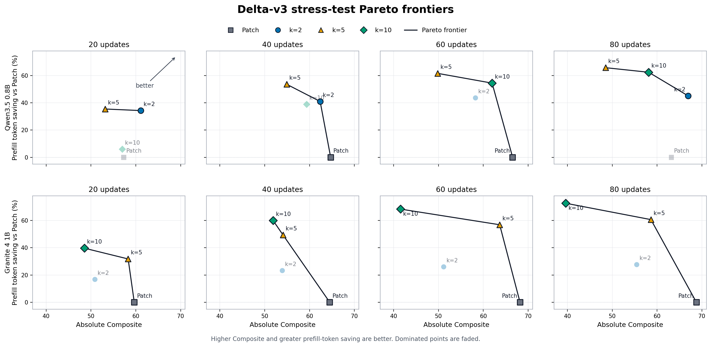

# Delta-v3 Stress Test: Qwen 0.8B와 Granite 1B 비교

갱신일: 2026-09-05

## 범위와 해석 기준

- 모델: Qwen3.5 0.8B, Granite 4 1B
- 학습 seed: 45
- 방법: Patch, Delta-v3 compact `k=2/5/10`
- 데이터: held-out Test `S86-S90`, 시나리오당 UPDATE `20/40/60/80`
- latency proxy: cache-ON controlled replay에서 Gold UPDATE **다음 요청**의 evaluated
  prefill tokens
- 성능: 별도 predicted closed-loop 실행의
  `0.60 × Quiz ESM + 0.25 × Final-state F1 + 0.15 × Update F1`
- 각 모델은 cache 16/16, Composite 16/16 job과 규모별 Quiz 200개를 완료했다.
- cache 측정은 1회 실행이므로 token 계산량을 주 지표로 사용하며 HF wall-clock을 최종
  latency로 해석하지 않는다.
- tokenizer와 prompt tokenization이 다르므로 모델 간 절대 token 수보다 각 모델 안의
  **Patch 대비 절감률**을 비교한다.

## 사용 checkpoint의 표준 성능

표준 Validation은 6개 시나리오·Quiz 240개, Test는 24개 시나리오·Quiz 960개다.

| 모델 | 방법 | Best epoch | Val Composite | Test Composite |
|---|---|---:|---:|---:|
| Qwen3.5 0.8B | Patch | 3 | 60.65 | **70.84** |
| Qwen3.5 0.8B | k=2 | 3 | **62.03** | 70.78 |
| Qwen3.5 0.8B | k=5 | 3 | 58.87 | 66.68 |
| Qwen3.5 0.8B | k=10 | 3 | 59.70 | 67.55 |
| Granite 4 1B | Patch | 3 | **60.68** | **71.74** |
| Granite 4 1B | k=2 | 3 | 57.26 | 69.73 |
| Granite 4 1B | k=5 | 4 | 54.77 | 67.38 |
| Granite 4 1B | k=10 | 4 | 58.88 | 64.33 |

표준 Test에서는 두 모델 모두 Patch가 가장 높다. Compact 중에서는 두 모델 모두 k=2가
가장 높으며 Patch와의 차이는 Qwen `-0.06`%p, Granite `-2.01`%p다.

## Granite 1B Stress Test

각 셀은 `UPDATE 직후 평균 prefill tokens (Patch 대비 절감률) / Composite`다.

| UPDATE/시나리오 | Patch | Delta k=2 | Delta k=5 | Delta k=10 |
|---:|---:|---:|---:|---:|
| 20 | 299.0 / **59.66** | 248.8 (-16.8%) / 50.88 | 204.0 (-31.8%) / 58.29 | **180.4 (-39.7%)** / 48.52 |
| 40 | 523.2 / **64.51** | 401.5 (-23.3%) / 53.92 | 265.0 (-49.4%) / 54.08 | **209.7 (-59.9%)** / 51.87 |
| 60 | 757.9 / **68.19** | 560.9 (-26.0%) / 51.16 | 327.1 (-56.9%) / 63.65 | **240.1 (-68.3%)** / 41.52 |
| 80 | 993.0 / **68.78** | 718.7 (-27.6%) / 55.46 | 391.1 (-60.6%) / 58.63 | **272.0 (-72.6%)** / 39.62 |

80 UPDATE의 p95 prefill tokens는 Patch `2,343.1`, k2 `2,320.2`(-1.0%), k5
`1,986.6`(-15.2%), k10 `1,396.9`(-40.4%)다. 30 prefill tok/s 단순 환산 평균은
Patch `33.1s`, k2 `24.0s`, k5 `13.0s`, k10 `9.1s`다. 이는 실제 on-device
end-to-end 측정값이 아니다.

## 모델 간 token 절감률 비교

각 셀은 `Qwen / Granite`의 Patch 대비 평균 prefill token 절감률이다.

| UPDATE | k=2 | k=5 | k=10 |
|---:|---:|---:|---:|
| 20 | 34.3% / 16.8% | 35.4% / 31.8% | 5.9% / 39.7% |
| 40 | 41.0% / 23.3% | 53.6% / 49.4% | 38.8% / 59.9% |
| 60 | 43.6% / 26.0% | 61.5% / 56.9% | 54.4% / 68.3% |
| 80 | 45.1% / 27.6% | 65.7% / 60.6% | 62.3% / 72.6% |

두 모델 모두 UPDATE가 증가할수록 Delta의 절감률이 커져 구조적인 cache 이점은
재현됐다. 다만 Qwen에서는 평균 token 기준 k=5, Granite에서는 k=10이 가장 강하다.

## 모델 간 Stress Composite 비교

각 셀은 `Qwen / Granite`의 같은 모델·UPDATE Patch 대비 Composite 차이(%p)다.

| UPDATE | k=2 | k=5 | k=10 |
|---:|---:|---:|---:|
| 20 | +3.81 / -8.78 | -4.12 / -1.37 | -0.30 / -11.14 |
| 40 | -2.35 / -10.59 | -9.82 / -10.43 | -5.36 / -12.64 |
| 60 | -8.29 / -17.03 | -16.72 / -4.54 | -4.57 / -26.67 |
| 80 | +3.74 / -13.32 | -14.68 / -10.15 | -5.07 / -29.16 |

4개 UPDATE 규모를 동일 가중 평균하면 다음과 같다. 이 값은 요약용 macro-average이며
개별 cell을 대체하지 않는다.

| 모델 | k | 평균 token 절감률 | 평균 Composite Δ |
|---|---:|---:|---:|
| Qwen3.5 0.8B | 2 | 41.0% | **-0.77%p** |
| Qwen3.5 0.8B | 5 | 54.1% | -11.34%p |
| Qwen3.5 0.8B | 10 | 40.4% | -3.82%p |
| Granite 4 1B | 2 | 23.4% | -12.43%p |
| Granite 4 1B | 5 | 49.7% | **-6.62%p** |
| Granite 4 1B | 10 | **60.1%** | -19.90%p |

## 결론

1. **Latency 이점은 두 모델에서 재현된다.** 80 UPDATE에서 모든 Delta 설정이 각자의
   Patch보다 평균 prefill을 줄였다.
2. **최적 k는 모델 의존적이다.** Qwen에서는 k=2가 가장 성능 보존적이고, Granite
   stress에서는 k=5가 Delta 중 Composite 손실이 가장 작다.
3. **Granite k=10은 명확한 speed-accuracy 극단점이다.** 평균 `72.6%`, p95 `40.4%`
   절감과 동시에 80 UPDATE Composite가 Patch보다 `29.16`%p 낮다.
4. **표준 Test만으로 stress robustness를 예측하기 어렵다.** Granite k=2는 Compact 중
   표준 Test 1위지만 반복 UPDATE에서는 큰 state 누적 손실을 보였다.
5. 현재 근거로 universal k를 주장하지 않는다. 논문에서는 구조적인 token 절감의
   재현성과 모델별 accuracy trade-off를 함께 보고하고, k 선택을 모델별 calibration
   대상으로 제시하는 것이 안전하다.

## 원시 결과

- Qwen3.5 0.8B:
  `/mnt/data/hj153lee/PalmClaw/on-device-memory-training/benchmarks/qwen35-0.8b-stress-test-once-20260904-v1`
- Granite 4 1B:
  `/mnt/data/hj153lee/PalmClaw/on-device-memory-training/benchmarks/granite4-1b-stress-test-once-20260904-v1`

이 결과는 모델별 seed 45와 latency 1회 측정에 기반한다. Qwen의 seed 46 결과는 표준
성능 sensitivity 확인용이며 이 Stress Test에는 포함하지 않았다.
