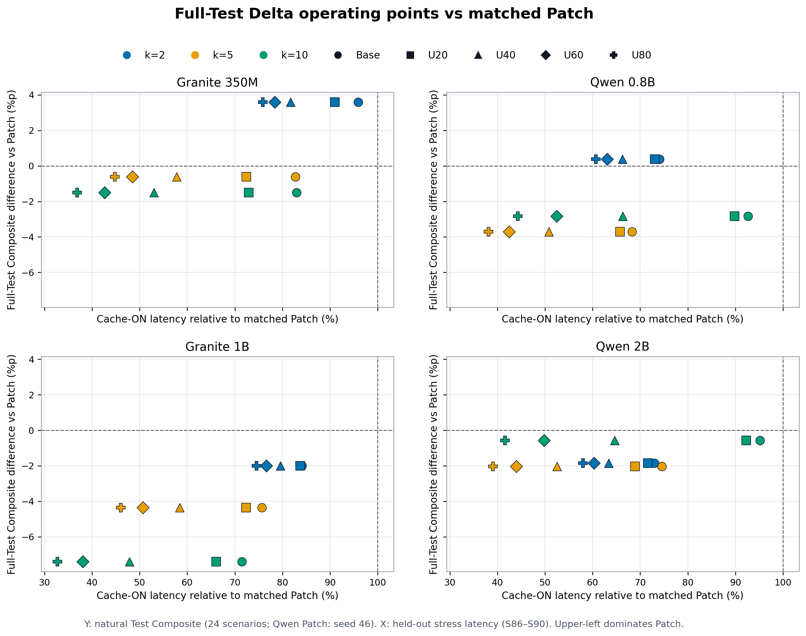

# Full-Test Composite × Cache-ON Stress Latency Figure 비교

## 공통 설정

- Y축 accuracy: 자연 Test 전체 24개 시나리오
- X축 latency: held-out stress subset S86–S90 5개 시나리오
- X축 기준: 동일 모델·workload의 Patch update-cycle latency = 100%
- Update-cycle: UPDATE turn decode + 직후 turn prefill
- Cache ON만 표시하며 Summary는 제외한다.
- Full-Test Patch accuracy는 Qwen 0.8B와 Qwen 2B만 seed 46 best checkpoint를 사용하고,
  나머지 모델·방법은 기존 선택 checkpoint를 사용한다.

Accuracy와 latency의 평가 범위가 다르므로 두 그림은 동일 stress workload의 엄밀한
Pareto가 아니라, **전체 Test 품질 대비 stress latency 민감도**를 보여준다.

## 대안 A: Absolute Composite k-sweep


- 동일 workload 선이 `Patch → k2 → k5 → k10`을 연결한다.
- 모델·방법의 실제 Composite 수준을 보존한다.
- 논문 독자가 절대 성능을 확인하기에 적합하다.
- workload별 선이 겹치므로 operating point를 즉시 분류하기는 상대적으로 어렵다.

## 대안 B: Patch-relative quadrant



- Y축은 동일 모델 Patch 대비 Full-Test Composite 차이(%p)다.
- 왼쪽 위는 Patch보다 빠르고 정확한 지배 영역이다.
- 왼쪽 아래는 latency를 줄이는 대신 accuracy를 양보하는 영역이다.
- 선을 제거해 k와 UPDATE별 operating point가 더 명확하다.
- 절대 Composite 수준이 사라지므로 대안 A 또는 성능 표가 함께 필요하다.

## U80 대표 해석

| 모델 | k | Patch 대비 latency | Composite Δ | 해석 |
|---|---:|---:|---:|---|
| Granite 350M | 2 | 75.8% | +3.60%p | Patch 지배 |
| Qwen 0.8B | 2 | 60.6% | +0.38%p | Patch보다 빠르고 정확한 지배점 |
| Granite 1B | 5 | 46.0% | -4.36%p | 중간 trade-off |
| Qwen 2B | 10 | 41.6% | -0.57%p | 0.57%p를 양보하며 58.4% 절감 |

Granite 1B와 Qwen 2B에서는 모든 Delta가 Patch보다 빠르지만 Composite가 낮다. Granite
350M과 Qwen 0.8B에는 Patch보다 빠르면서 더 정확한 operating point가 있다. 최적 latency
k는 Granite에서 k10, Qwen에서 주로 k5이지만, accuracy까지 포함하면 k2 또는 k10이
선택되는 경우가 있어 단일 k가 보편적으로 우월하지 않다.

## 권장 사용

1. Main figure: 대안 A로 절대 Composite를 보고한다.
2. 바로 뒤의 분석 figure 또는 inset: 대안 B로 Patch 지배/절충 영역을 설명한다.
3. 공간상 하나만 쓸 경우 대안 B를 선택하고, 각 모델·방법의 전체 Test Composite 표를
   함께 둔다.
4. Cache OFF는 Patch와 Delta가 거의 같다는 sanity check 표로 appendix에 둔다.

## 재현

- 코드: `memory_training/scripts/plot_full_test_composite_stress_latency.py`
- 입력: `docs/engineering/results/stress-tradeoff-four-models.json`
- 출력:
  - `docs/engineering/figures/full-test-composite-cache-on-stress-latency.{png,pdf}`
  - `docs/engineering/figures/full-test-composite-delta-cache-on-quadrants.{png,pdf}`

```bash
/mnt/data/hj153lee/conda-envs/palmclaw-memory-sft/bin/python \
  memory_training/scripts/plot_full_test_composite_stress_latency.py
```
