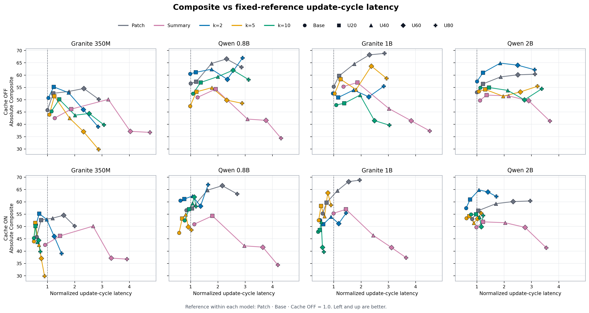

# Fixed-reference Composite–Latency Figure 기록

## 목적

4개 모델의 절대 처리속도 차이를 제거하면서, UPDATE 증가와 KV-cache 적용이
Patch/Summary/Delta-v3의 accuracy–latency trade-off를 어떻게 바꾸는지 함께 본다.

이 문서는 현재 figure의 설계와 재현 방법을 보존하기 위한 기록이다. 시각적 구성과
정규화 기준은 추후 개선할 수 있으며, 현재 버전을 최종 논문 figure로 확정하지 않는다.

## 데이터 범위

- Held-out stress subset: S86–S90, 5 scenarios
- 모델: Granite 350M, Qwen 0.8B, Granite 1B, Qwen 2B
- 방법: Patch, Summary, Delta-v3 compact `k=2/5/10`
- UPDATE 부하: Base, U20, U40, U60, U80
- Cache 조건: OFF projection, ON replay
- 성능: absolute Composite

전체 Test 24개 시나리오가 아니라, UPDATE stress를 생성한 5개 시나리오 subset의
결과임을 명시해야 한다.

## Update-cycle 정의

한 UPDATE의 런타임 영향은 다음 두 비용의 합으로 정의한다.

```text
update-cycle
= UPDATE turn의 decode 생성
 + 바로 다음 turn의 prefill
```

다른 NO-OP turn의 비용과 post-UPDATE turn의 decode는 포함하지 않는다.

```text
Cache OFF cycle latency
= UPDATE decode tokens / decode tok/s
 + post-UPDATE logical prefill tokens / prefill tok/s

Cache ON cycle latency
= UPDATE decode tokens / decode tok/s
 + post-UPDATE evaluated prefill tokens / prefill tok/s
```

각 UPDATE와 동일 scenario/repetition의 직후 turn을 1:1로 연결해 cycle 평균을 계산했다.
Base 67개, U20/40/60/80은 각각 100/200/300/400개 cycle이며, 모든 cell에서 누락 없이
짝이 맞는 것을 검증했다.

## 고정 정규화

각 모델 안에서 하나의 기준점만 사용한다.

```text
Reference(model) = Patch · Base · Cache OFF cycle latency

Normalized latency
= latency(model, method, workload, cache)
 / Reference(model)
```

- `1.0`: 해당 모델의 Patch/Base/Cache-OFF와 같은 latency
- `< 1.0`: 기준보다 빠름
- `> 1.0`: 기준보다 느림
- X축은 왼쪽일수록, Y축 Composite는 위쪽일수록 좋다.

Cache ON/OFF 또는 workload마다 분모를 다시 잡지 않으므로 Base→U80의 증가와
OFF→ON cache 효과가 사라지지 않는다. 반면 모델 간 절대 초 단위 차이는 제거된다.

## Figure 구성

- 열: 4개 모델
- 위 행: Cache OFF
- 아래 행: Cache ON
- 색: Patch, Summary, k2, k5, k10
- marker: Base, U20, U40, U60, U80
- 같은 방법의 workload 점을 선으로 연결
- 세로 점선 `x=1.0`: 모델별 고정 reference



## 현재 읽을 수 있는 방향

- Cache OFF에서는 UPDATE가 증가할수록 대부분의 방법이 오른쪽으로 이동한다.
- Cache ON에서는 Delta k5/k10의 latency 증가가 상대적으로 억제된다.
- k2는 일부 Qwen 조건에서 Composite를 보존하면서 cache latency도 줄이는 점을 만든다.
- Summary는 긴 UPDATE decode 때문에 높은 UPDATE 부하에서 대체로 오른쪽·아래에 놓인다.

이는 관찰 요약이며, 방법론의 최종 우열은 동일 조건 Patch 대비 절감률과 absolute
latency figure를 함께 보고 판단해야 한다.

## 알려진 한계와 개선 후보

1. 8개 패널과 두 종류의 범례가 있어 한 번에 읽을 정보가 많다.
2. 선으로 연결된 점은 workload trajectory이지 통계적 Pareto frontier가 아니다.
3. Composite가 update 수에 따라 단조롭지 않아 선이 복잡하게 교차한다.
4. 정규화 때문에 모델별 절대 on-device latency 차이는 보이지 않는다.
5. Summary가 주 분석 대상이 아니라면 흐리게 표시하거나 overview에서만 남길 수 있다.
6. Patch와 Delta만 남긴 main figure, workload별 facet, 동일 조건 Patch 대비 절감률 표를
   후보로 비교한다.

## 재현 코드와 입력

- Plot code:
  `memory_training/scripts/plot_stress_tradeoff_fixed_reference.py`
- Aggregate code:
  `memory_training/scripts/aggregate_stress_tradeoff.py`
- Input:
  `docs/engineering/results/stress-tradeoff-four-models.json`
- Output:
  `docs/engineering/figures/stress-tradeoff-fixed-patch-base-normalized.{png,pdf}`

저장소 루트에서 다음 명령으로 재생성한다.

```bash
/mnt/nvme2/hj153lee/conda-envs/palmclaw-memory-sft/bin/python \
  memory_training/scripts/aggregate_stress_tradeoff.py

/mnt/nvme2/hj153lee/conda-envs/palmclaw-memory-sft/bin/python \
  memory_training/scripts/plot_stress_tradeoff_fixed_reference.py
```

핵심 구현은 모델별 reference를 먼저 구한 뒤 각 cache 조건의 cycle latency를 동일한
reference로 나누는 방식이다.

```python
reference = methods["Patch"]["base"]["update_cycle"]["cache_off_seconds_mean"]
normalized_latency = (
    methods[method][workload]["update_cycle"][latency_key] / reference
)
```

## 관련 문서

- [4-model Update Stress 정확도·비용 Pareto 결과](stress-tradeoff-four-models.md)
- [Composite–Latency 요약 테이블](results/stress-tradeoff-composite-latency-tables.md)
- [Patch 대비 Delta latency 절감률](results/patch-vs-delta-update-cycle-latency-savings.md)
- [상세 Cache ON/OFF 테이블](results/stress-tradeoff-four-models-tables.md)
