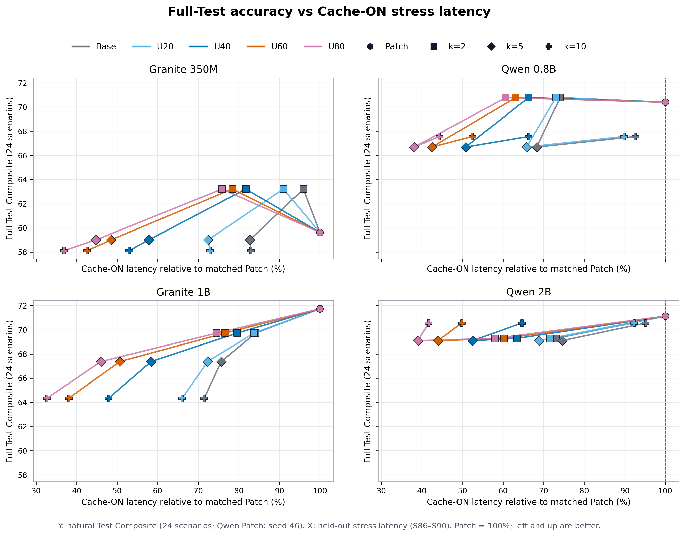
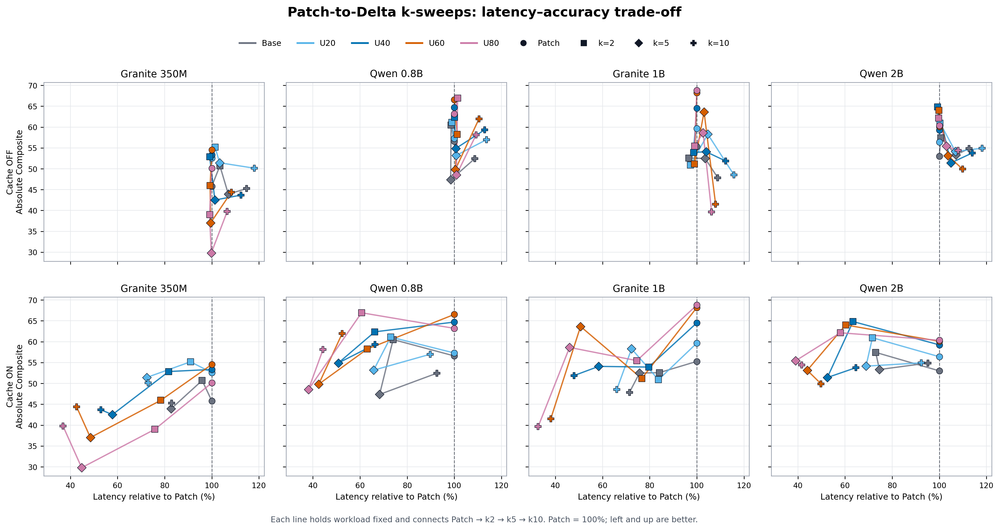
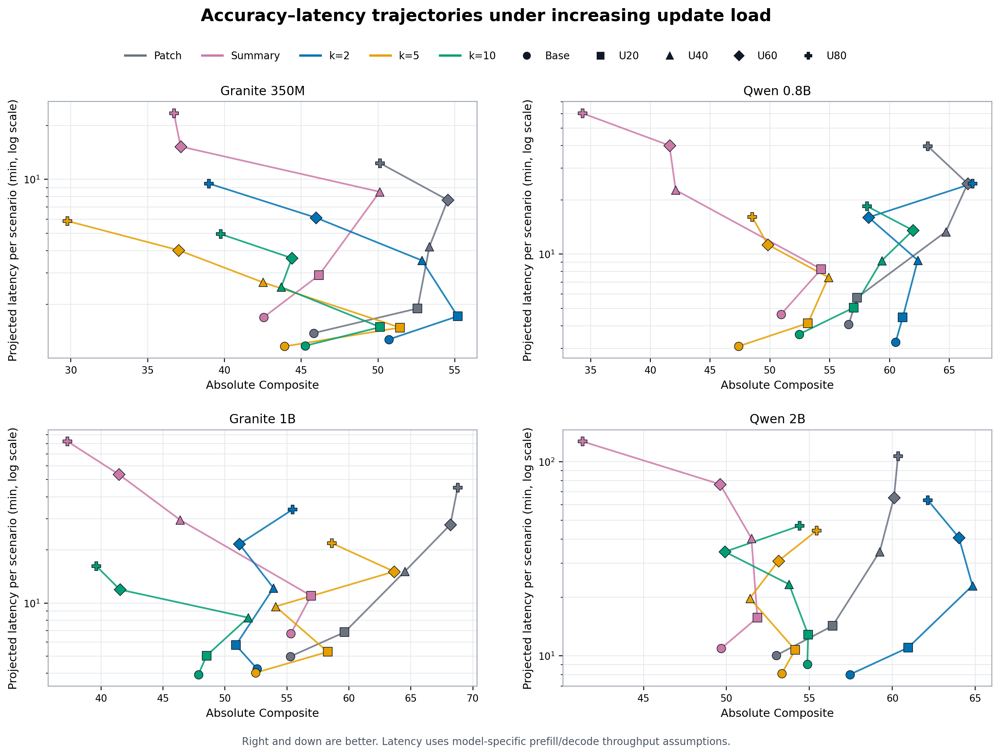
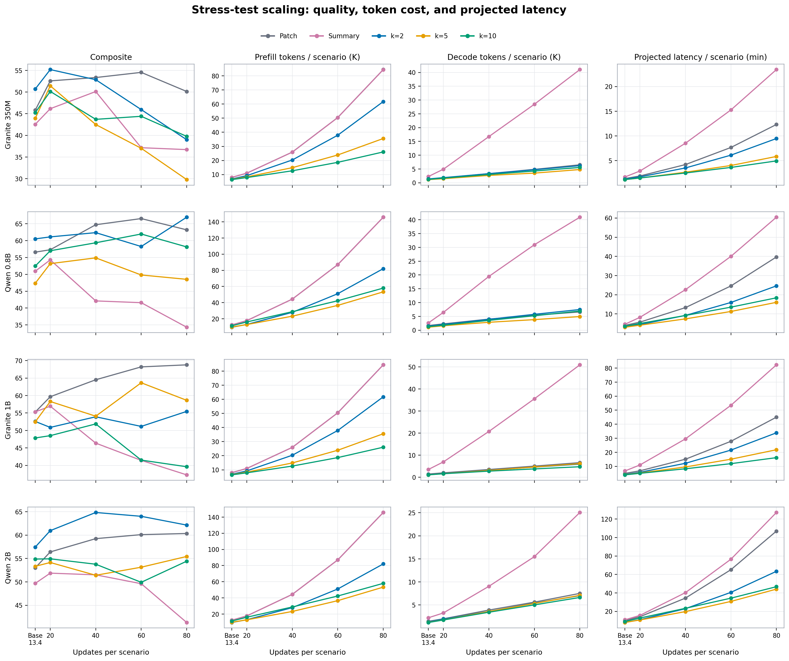
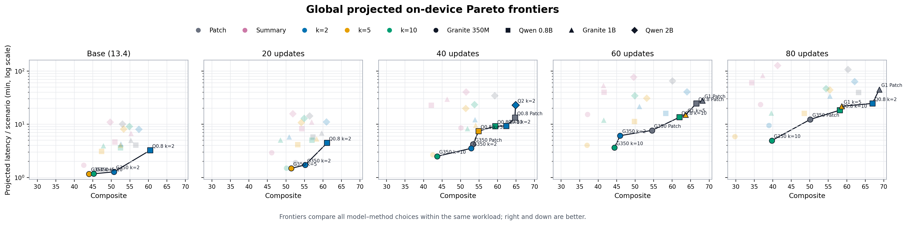

# 4-model Update Stress 정확도·비용 Pareto 결과

## 목적과 범위

자연 Test 기준선과 UPDATE stress에서 Patch, Summary, Delta-v3 compact
`k=2/5/10`의 정확도–비용 trade-off를 비교한다. 대상은 S86–S90 5개 시나리오와
Granite 350M, Qwen 0.8B, Granite 1B, Qwen 2B이다.

- **Base:** 합성 UPDATE를 넣지 않은 원본 S86–S90, 평균 13.4 UPDATE/시나리오
- **Stress:** 동일 시나리오를 20/40/60/80 UPDATE로 확장한 고정 데이터
- **정확도:** `0.60 × Quiz ESM + 0.25 × Final-state F1 + 0.15 × Update F1`
- **비용:** cache-ON controlled replay에서 실제 생성된 evaluated prefill/decode token
- **Projected latency:** `prefill tokens / prefill tok/s + decode tokens / decode tok/s`
- 총 `4 모델 × 5 방법 × 5 workload = 100`개 cell이 완성됐다.

Stress의 token/latency는 5개 시나리오 전체 turn을 합산해 비교한다. 원본 JSON/CSV에는
전체, UPDATE, NO-OP, UPDATE 직후 각각의 평균·p95·누적값도 포함한다. `generation_errors`는
모델 출력의 parse/application 실패 횟수이며 KV-cache 자체의 오류가 아니다.

## Throughput 가정

| 실험 모델 | Prefill | Decode | 사용한 on-device proxy |
|---|---:|---:|---|
| Granite 350M | 137.7 tok/s | 51.8 tok/s | Granite 4.0 350M |
| Qwen 0.8B | 68.0 tok/s | 27.6 tok/s | Qwen3 0.6B |
| Granite 1B | 35.7 tok/s | 19.8 tok/s | Llama 3.2 1B |
| Qwen 2B | 24.7 tok/s | 14.5 tok/s | Qwen3 1.7B |

따라서 latency는 실측 wall-clock이 아니라 지정한 throughput에 대한 projection이다.
특히 0.8B·1B·2B는 같은 모델의 실측치가 아니므로 절대 시간보다 방법 간 상대 비교가
우선이다.

## Composite 전체 결과

| 모델 | 방법 | Base | U20 | U40 | U60 | U80 |
|---|---|---:|---:|---:|---:|---:|
| Granite 350M | Patch | 45.81 | 52.57 | 53.35 | 54.54 | 50.13 |
|  | Summary | 42.55 | 46.15 | 50.11 | 37.15 | 36.71 |
|  | k=2 | **50.71** | **55.18** | 52.85 | 45.95 | 38.99 |
|  | k=5 | 43.92 | 51.44 | 42.50 | 37.01 | 29.79 |
|  | k=10 | 45.25 | 50.14 | 43.70 | 44.40 | 39.76 |
| Qwen 0.8B | Patch | 56.58 | 57.29 | **64.71** | **66.54** | 63.20 |
|  | Summary | 50.93 | 54.29 | 42.12 | 41.60 | 34.32 |
|  | k=2 | **60.51** | **61.11** | 62.36 | 58.25 | **66.94** |
|  | k=5 | 47.36 | 53.17 | 54.89 | 49.81 | 48.52 |
|  | k=10 | 52.45 | 57.00 | 59.36 | 61.96 | 58.13 |
| Granite 1B | Patch | 55.28 | **59.66** | **64.51** | **68.19** | **68.78** |
|  | Summary | **55.32** | 56.95 | 46.38 | 41.45 | 37.30 |
|  | k=2 | 52.58 | 50.88 | 53.92 | 51.16 | 55.46 |
|  | k=5 | 52.47 | 58.29 | 54.08 | 63.65 | 58.63 |
|  | k=10 | 47.86 | 48.52 | 51.87 | 41.52 | 39.62 |
| Qwen 2B | Patch | 53.00 | 56.40 | 59.24 | 60.10 | 60.34 |
|  | Summary | 49.68 | 51.86 | 51.50 | 49.61 | 41.32 |
|  | k=2 | **57.44** | **60.95** | **64.83** | **64.01** | **62.14** |
|  | k=5 | 53.33 | 54.14 | 51.41 | 53.14 | 55.43 |
|  | k=10 | 54.87 | 54.92 | 53.77 | 49.91 | 54.42 |

굵은 값은 각 모델·workload의 최고 Composite다. Stress 정확도는 update 수에 대해
단조롭게 변하지 않는다. 그러므로 정확도의 선형 추세를 주장하지 않고, 각 workload에서
관측된 점을 그대로 Pareto 비교한다.

## 비용 증가의 선형성

U20–U80에서 시나리오당 누적 projected latency를 UPDATE 수에 선형 회귀했다.

| 모델 | Patch | Summary | k=2 | k=5 | k=10 |
|---|---:|---:|---:|---:|---:|
| Granite 350M | 0.174 (0.978) | 0.341 (0.993) | 0.129 (0.982) | 0.072 (0.989) | **0.057 (0.996)** |
| Qwen 0.8B | 0.566 (0.978) | 0.869 (0.994) | 0.336 (0.984) | **0.198 (0.993)** | 0.222 (0.999) |
| Granite 1B | 0.637 (0.976) | 1.189 (0.991) | 0.469 (0.981) | 0.276 (0.990) | **0.186 (0.996)** |
| Qwen 2B | 1.543 (0.976) | 1.851 (0.976) | 0.874 (0.981) | **0.556 (0.993)** | 0.563 (0.999) |

값은 `분/추가 UPDATE (R²)`이다. 모든 방법의 latency 증가는 거의 선형
(`R²=0.976–0.999`)이지만 기울기는 크게 다르다. Delta k=5/10의 증가율이 가장 낮고,
Summary는 동일한 prefill 증가에 긴 summary decode가 더해져 가장 비싸다.

Prefill 기울기의 R²도 `0.971–0.998`, decode 기울기의 R²도 `0.985–1.000`이다.
Granite 계열의 prefill 기울기는 Patch/Summary `1,224.9`, k2 `876.0`, k5 `453.5`,
k10 `302.5` token/UPDATE/시나리오였다. Qwen 계열은 각각 `2,131.8`, `1,150.6`,
`673.4`, `696.0`이었다. 즉 k10이 항상 k5보다 작은 것은 아니며, prompt/tokenizer와
생성 길이의 모델 계열 차이가 실제 Pareto 위치를 바꾼다.

## U80 대표 비교

| 모델 | 방법 | Composite | Prefill K/scenario | Decode K/scenario | Latency min/scenario | Turn p95 |
|---|---|---:|---:|---:|---:|---:|
| Granite 350M | Patch | 50.13 | 84.5 | 6.5 | 12.3 | 15.8 s |
|  | Summary | 36.71 | 84.4 | 41.0 | 23.4 | 17.6 s |
|  | k=2 | 38.99 | 61.8 | 6.2 | 9.5 | 15.9 s |
|  | k=5 | 29.79 | 35.6 | 4.8 | 5.8 | 11.1 s |
|  | k=10 | 39.76 | 26.0 | 5.6 | 4.9 | 3.5 s |
| Qwen 0.8B | Patch | 63.20 | 145.7 | 6.6 | 39.7 | 44.1 s |
|  | Summary | 34.32 | 145.7 | 40.9 | 60.4 | 46.5 s |
|  | k=2 | **66.94** | 82.0 | 7.5 | 24.6 | 40.7 s |
|  | k=5 | 48.52 | 53.3 | 4.9 | **16.1** | 28.7 s |
|  | k=10 | 58.13 | 58.0 | 6.9 | 18.4 | **15.5 s** |
| Granite 1B | Patch | **68.78** | 84.5 | 6.6 | 45.0 | 60.6 s |
|  | Summary | 37.30 | 84.4 | 50.9 | 82.3 | 67.9 s |
|  | k=2 | 55.46 | 61.8 | 6.0 | 33.9 | 60.8 s |
|  | k=5 | 58.63 | 35.6 | 6.2 | 21.8 | 42.8 s |
|  | k=10 | 39.62 | 26.0 | 4.8 | **16.2** | **12.4 s** |
| Qwen 2B | Patch | 60.34 | 145.7 | 7.5 | 106.9 | 120.4 s |
|  | Summary | 41.32 | 145.7 | 25.1 | 127.1 | 122.9 s |
|  | k=2 | **62.14** | 82.0 | 7.0 | 63.4 | 111.1 s |
|  | k=5 | 55.43 | 53.3 | 7.1 | **44.1** | 78.7 s |
|  | k=10 | 54.42 | 58.0 | 6.6 | 46.8 | **41.7 s** |

U80에서 Patch 대비 projected latency 절감률은 k2 `23–41%`, k5 `53–60%`,
k10 `54–64%` 범위다. Qwen 0.8B와 2B의 k2는 각각 Composite를 `+3.74`, `+1.80`%p
높이면서 latency도 `38.0%`, `40.7%` 줄인 강한 Pareto 결과다. 반면 Granite 1B는
Patch가 정확도 우위를 크게 유지하여, k5가 비용 절감형 operating point 역할을 한다.

## Figure 해석

현재 fixed-reference figure의 설계, 해석 한계와 재현 방법은
[Fixed-reference Composite–Latency Figure 기록](stress-tradeoff-fixed-reference-figure.md)에
별도로 보존한다.

Cache ON에 집중한 두 가지 단순화 후보와 권장 용도는
[Cache-ON Patch–Delta Figure 대안 비교](cache-on-tradeoff-figure-alternatives.md)에
정리한다.

전체 Test Composite로 교체한 최종 대안 A/B 비교는
[Full-Test Composite × Cache-ON Stress Latency Figure 비교](full-test-composite-cache-on-figure-comparison.md)에
정리한다.

Y축은 전체 자연 Test 24개 시나리오 Composite, X축은 held-out stress subset S86-S90의
Cache-ON latency다. 전체 Test 품질과 stress latency 민감도를 결합한 배포 관점의 그림이며,
동일 stress workload의 accuracy–latency Pareto로 해석하지 않는다.

각 모델·workload·cache 조건의 Patch latency를 `100%`로 다시 잡은 직접적인
Patch–Delta 비교다. 각 선은 동일 workload에서 `Patch → k2 → k5 → k10`을 연결한
k-sweep이며, X축 왼쪽은 Patch보다 빠르고 Y축 위쪽은 Composite가 높다.

각 모델의 `Patch · Base · Cache OFF = 1.0`을 고정 기준으로 삼아 Cache OFF/ON과
Base→U80 scaling을 동시에 보존한 본문용 비교다. 왼쪽·위쪽이 좋다.

각 선은 한 방법의 Base→U80 trajectory다. 오른쪽·아래쪽이 좋다. workload가 다른 점을
연결한 경향도이며, 선 자체가 엄밀한 Pareto frontier는 아니다.

Composite, prefill, decode, projected latency를 같은 UPDATE 축으로 분리해 원인을 보인다.
Summary는 Patch와 prefill이 거의 같지만 decode가 급증하므로 총 latency가 더 나빠진다.

각 패널은 동일 workload 안에서 4모델×5방법을 함께 비교한 실제 비지배 frontier다.
모델 처리속도가 다르므로 작은 모델이 global latency frontier를 주로 차지한다. 방법론
효과를 주장할 때는 이 그림만 쓰지 말고 모델별 trajectory와 함께 제시해야 한다.

## 결론

1. **비용 scaling:** UPDATE가 증가할수록 Delta의 이점이 거의 선형적으로 확대된다.
2. **k trade-off:** k2는 정확도 보존형, k5/10은 공격적 비용 절감형이라는 해석이 가장
   일관적이다. 다만 최적 k는 모델별로 다르다.
3. **Summary:** prefill은 Patch와 비슷하고 decode가 훨씬 길어 이 stress 조건에서는
   비용과 정확도 양쪽에서 대체로 열위다.
4. **논문 주장:** “Delta가 항상 최고”가 아니라, update intensity와 모델에 따라 선택할 수
   있는 더 넓은 accuracy–latency Pareto set을 제공한다는 주장이 데이터에 맞다.

## 재현 파일

- 본문용 Composite–latency 요약:
  [Cache OFF/ON 분리 테이블](results/stress-tradeoff-composite-latency-tables.md)
- 동일 조건 Patch 대비 Delta 핵심 표:
  [update-cycle latency 절감률](results/patch-vs-delta-update-cycle-latency-savings.md)
- Cache ON/OFF 전체 표:
  [통합 Markdown 테이블](results/stress-tradeoff-four-models-tables.md)
- 집계 데이터: [JSON](results/stress-tradeoff-four-models.json),
  [CSV](results/stress-tradeoff-four-models.csv)
- 집계 코드: `memory_training/scripts/aggregate_stress_tradeoff.py`
- Figure 코드: `memory_training/scripts/plot_stress_tradeoff_four_models.py`
- PDF: [model trajectories](figures/stress-tradeoff-model-pareto-trajectories.pdf),
  [scaling grid](figures/stress-tradeoff-four-model-scaling.pdf),
  [global frontiers](figures/stress-tradeoff-global-pareto-frontiers.pdf)
